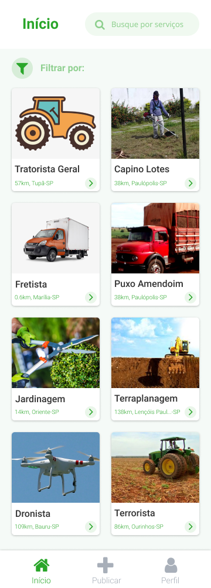

# Bem vindo(a) ao AgroM

## O que somos?

O AgroM é um Marketplace de **serviços agrícolas**. Esperamos atingir todo o agronegócio, facilitando o acesso à busca por serviços de terceiros através de nossa plataforma.

### Facilidade

Feito de forma **simples** para **simplificar** seu trabalho.

```markdown
Nossas features:

- Cadastro na plataforma
- Busca por serviços
- Publicação de serviços
- Facilitação no contato
```

For more details see [GitHub AgroM](https://github.com/victormachado01/agrom).

**Página inicial:** Buscamos encontrar uma interface simples e intuitiva, exibindo apenas os serviços fornecidos por terceiros na aplicação, garantindo que o usuario não tenha disterações durante o uso



### Publicação expandida

Ao clicar em uma publicação, você pode exibir mais detalhes sobre a mesma, como descrição do serviço, valores, localidade e telefone para contato.


### Publique seu próprio serviço!

Com o preenchimento de um formulario simples e intuitivo, você pode em poucos segundos adicionar as fotos do seu serviço, descrição, valores e todos as outras informações necessárias para que os outros possam contactar você.


